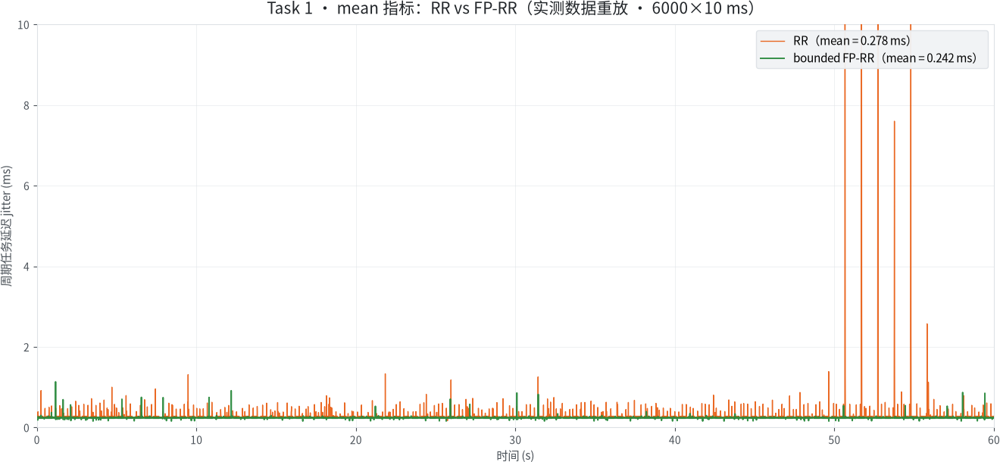
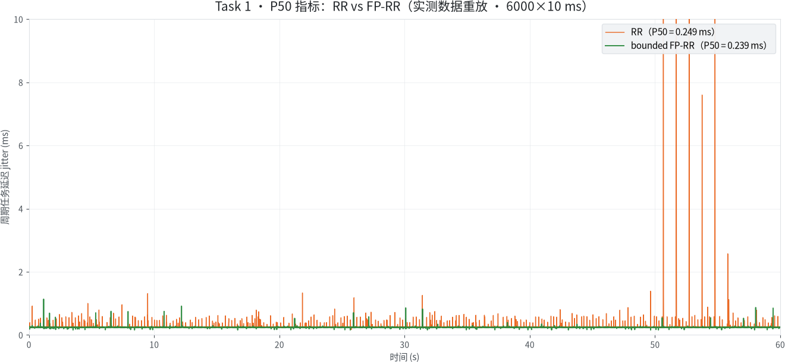
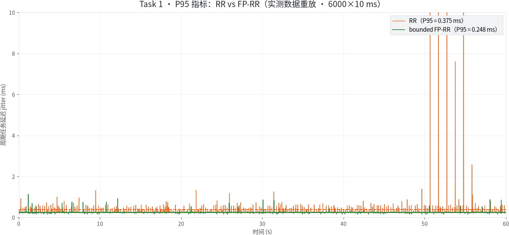
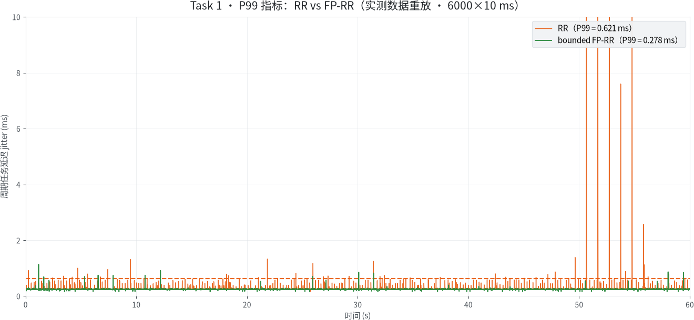
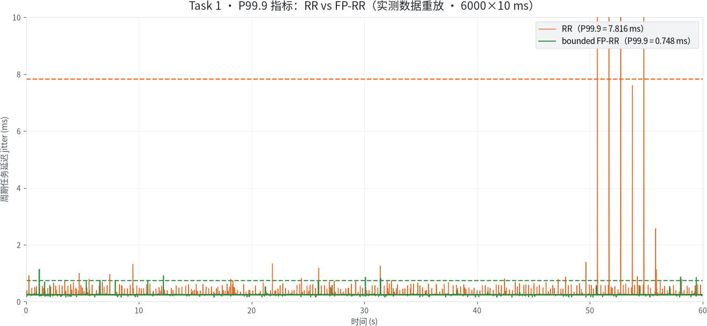
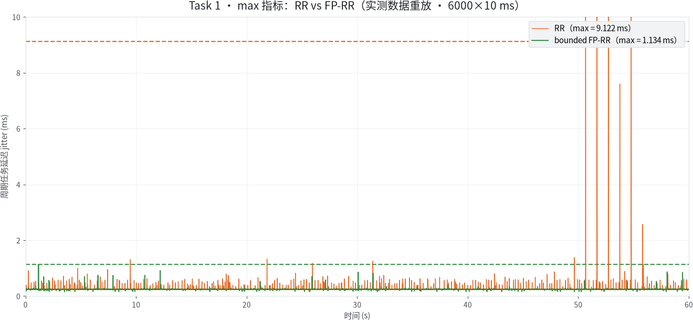
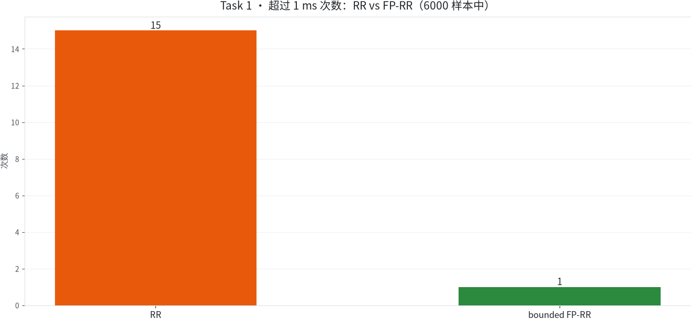
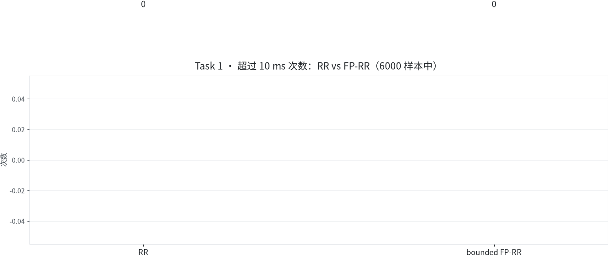
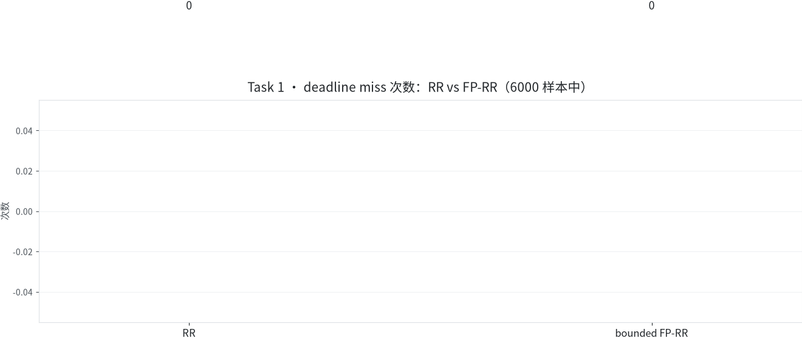

# Task 1：实时调度设计与结果

## 任务思路：先隔离重负载，再保证共享 CPU 上的优先级

赛题要求不仅是“启动一个 RTOS”，而是改造 AxVisor 的关键实时路径、启动不少于 2 个 vCPU 的多核类 Linux StarryOS Guest，并同时提供改造前后、空载/压力和原生 RTOS 基线。我们的判断是：AI 推理是否快，和 RTOS 能否按时被调度，是两个不同问题。因此采用两层设计：

1. **空间隔离**：StarryOS vCPU0 固定在 pCPU2，负责图像预处理、RKNN/NPU 提交和后处理；把重计算移出实时共享核。
2. **时间隔离**：StarryOS 通信 vCPU1 与 Zephyr vCPU0 共享 pCPU1；Zephyr 使用优先级 90，StarryOS 使用 89，在 bounded FP-RR 下允许高优先级唤醒抢占，同时给低优先级通信 Guest 保留有界服务。

这比“给 RTOS 独占一颗核”更接近赛题的混合负载：实时 Guest 和通信 Guest 真实共享处理器，AI 主路又不会直接堵住 RTOS。

### 为什么不能直接照搬 Linux 的普通 CFS/RR 思路

从 Linux 的角度，普通分时调度首先追求整体吞吐、公平和平均响应：一个 CPU-bound
任务多运行一个时间片，通常只是另一个普通任务晚一点得到 CPU。RTOS 周期任务的目标
不同。10 ms 周期意味着每次唤醒都有一个明确 deadline；平均值很好但偶发 12 ms 尾延迟，
仍然是一次控制周期失约。因此 Task 1 优先优化的是 P99/P99.9/max 和 deadline miss，
而不是只优化平均吞吐。

简单 RR 只有“轮到谁”的公平性，不理解“刚刚被 timer/IRQ 唤醒的 RTOS 工作比正在执行
的图像或通信工作更紧急”。严格 fixed-priority 又会产生相反问题：Zephyr priority 90
长期 runnable 时，StarryOS priority 89 可能得不到网络栈和 STATUS 回传的执行机会，最终
实时任务本身也会等不到闭环状态。因此采用 bounded FP-RR：

```text
timer / vIRQ 唤醒高优先级 RTOS
                |
                v
       +-------------------+
       | 唤醒点 / IRQ-tail |
       +-------------------+
                |
                +---- 高优先级 runnable ----> 立即选择 Zephyr vCPU
                |
                +---- 同优先级 ------------> RR 公平轮转
                |
                +---- 有界服务窗口到期 ------> 让通信 vCPU 前进
```

这对应两个同时成立的工程目标：RTOS 的 deadline 优先；控制链路不能因严格优先级而
饿死。低优先级服务计数不是“性能噪声”，而是系统仍具备活性的证据。

### 为什么正式架构选择“通信与 RTOS 共核”

AI 的 CPU 侧预处理、RKNN 提交和后处理会产生较长 CPU burst；如果它们
与 Zephyr 共核，RR 基线会被显著干扰，FP-RR 的相对改善也会显得更大。
但产品架构的目标不是人为做差基线以获得更大倍数，而是从源头减少
RTOS 遭受的干扰。

```text
正式空间隔离：

pCPU2  [ StarryOS vCPU0：预处理 -> RKNN/NPU -> 后处理 ]

pCPU1  [ StarryOS vCPU1：VirtIO/T2N1 ] <----> [ Zephyr：10 ms 周期与控制 ]
             priority 89                              priority 90
                 \________________________________________/
                         bounded FP-RR 时间隔离
```

通信 vCPU 与 Zephyr 共享 pCPU1，是因为它们共同构成 CONTROL/STATUS
闭环：RTOS 必须及时执行，通信也必须持续前进。这正好对应 bounded
FP-RR 的两个目标：高优先级 RTOS 可抢占，低优先级通信 Guest 又有有界服务。

### 三层证据的定位

| 证据层级 | 与 RTOS 共核的工作 | 作用 | 能否代表正式架构 |
| --- | --- | --- | --- |
| 正式主线 `communication-share` | VirtIO-net、T2N1、CONTROL/STATUS、IRQ | 验证最终工程拓扑 | **是** |
| 高竞争参考/ablation | AI 预处理、推理调用、后处理 | 放大干扰，观察调度机制在重压下的作用 | **否** |
| 无竞争基线 | 无持续共核竞争者 | 说明优化不会在无竞争时凭空产生 | **否** |

```text
正式主线：       0.621 ms -> 0.278 ms，P99 降低 55.3%
高竞争 QEMU 参考：14.291 ms -> 1.091 ms，P99 约 13.1x
无竞争 QEMU 基线：RR 与 FP-RR 接近
```

高竞争参考的倍数更大，是因为其 RR 基线更差，不代表该拓扑更优。
而且 QEMU 与 RK3588 实板的绝对数值不可横向比较；只能在各自相同平台、
相同拓扑的 RR/FP-RR A/B 内解释。

## 对 AxVisor 的实质改造

- 增加可选的 bounded FP-RR：更高优先级 runnable vCPU 可在唤醒和 IRQ-tail 抢占；同优先级继续 RR；低优先级 vCPU 获得有界服务，避免严格优先级饥饿。
- 明确 vCPU/pCPU 亲和性与 `host_sched_priority`，让配置而不是启动偶然性决定实时拓扑。
- 修复 AArch64 CNTV 激活所有权泄漏：若 Guest virtual timer 未 asserted，已 acknowledge 的 host CNTV token 立即退休，避免共享 pCPU 停止产生后续 timer IRQ。
- 为 vIRQ 使用有界队列和 retry slot，处理 GIC LR 竞争，不用无界分配或静默丢边沿。
- 把唤醒、通知、IPI 和 host IRQ 完成动作移出宽锁临界区，限制 IRQ/调度关键路径的阻塞来源。

相关机制详见 [`docs/design/task1-realtime-design.md`](../docs/design/task1-realtime-design.md)
和 [`docs/design/axvisor-aarch64-generic-timer.md`](../docs/design/axvisor-aarch64-generic-timer.md)。

### CNTV 激活所有权修复

共享 pCPU 的 10 ms 周期中断曾在启动后停止推进。诊断发现，host CNTV 已经
acknowledge，但 Guest virtual timer 尚未 asserted 的早返回分支没有 retire host
token，使 GIC 一直保留 active 状态，后续定时器边沿无法再次送达。

```text
Host CNTV acknowledged
          |
          +-- Guest timer asserted --> 注入或排队 vIRQ --> retire host token
          +-- not asserted ------------------------------> 立即 retire
          +-- LR 暂不可用 ----------> bounded retry ----> 成功后清理状态
```

修复把 acknowledge、pending/retry 和 retire 变成显式状态转换，并保证先完成
GIC deactivate/EOI，再释放 IRQ context 与抢占 guard。确定性回归覆盖未
asserted、单次注入、LR 暂不可用、retry 成功和重复边沿。实板诊断中，修复前
对应 pCPU 的 timer IRQ 停在 `432`；修复后两次分别推进到 `117117` 和 `30020`，
Zephyr 均完整输出 300 个周期样本。正式 3+3 长运行结果在下文统一报告。

## 多核 Guest 与资源配置

| 对象 | 配置 | 设计理由 |
| --- | --- | --- |
| StarryOS Guest | 2 vCPU，`phys_cpu_ids=[0x200,0x100]`，priority 89 | vCPU0/pCPU2 承担 AI；vCPU1/pCPU1 承担通信 |
| StarryOS 内存 | `0x4000_0000..0x7fff_ffff`，1 GiB | 与 Zephyr 地址空间分离 |
| StarryOS 设备 | RK3588 NPU、eMMC、独立 VirtIO-net | NPU 及依赖只归 StarryOS |
| Zephyr Guest | 1 vCPU，`phys_cpu_ids=[0x100]`，priority 90 | 与通信 vCPU 共享 pCPU1并获得更高实时优先级 |
| Zephyr 内存 | `0xA000_0000..0xBfff_ffff`，512 MiB | 独立 stage-2 区间 |
| Zephyr 设备 | 独立 PL011、VirtIO-net | 控制与通信，不映射 NPU |

模板分别位于 [`starry.toml.in`](../scripts/board/task123-zephyr/starry.toml.in) 和 [`zephyr.toml.in`](../scripts/board/task123-zephyr/zephyr.toml.in)。

## 设计

物理板上，StarryOS vCPU0 在 pCPU2 执行图像、RKNN/NPU 和后处理；StarryOS vCPU1 与 Zephyr vCPU0 共享 pCPU1。简单 RR 不能表达 RTOS 优先级，无界严格优先级又可能饿死较低优先级的 StarryOS 通信 vCPU。

bounded FP-RR 允许更高优先级唤醒抢占，同优先级 runnable 工作以 RR 轮转，并为低优先级 Guest 保留有界服务。中断尾调度按优先级决策；每 vCPU 使用有界 vIRQ 队列和 retry slot，防止 LR 竞争下丢边沿。

## 高竞争 QEMU RR/FP-RR 机制参考

这是同一代码和同一负载下的调度策略 A/B，不是旧代码与新代码对比。RR 组和
FP-RR 组使用同一 StarryOS ncnn/YOLO 负载、Zephyr 二进制、10 ms/300 样本探针
和 CPU 映射，只改变 AxVisor 调度策略。它用于解释强竞争下的调度机制，不作为
正式实板拓扑的统计结论。

| 三次运行的中位指标 | RR 组 | bounded FP-RR 组 | 变化 |
| --- | ---: | ---: | ---: |
| P99 唤醒抖动 | 14.291 ms | 1.091 ms | 13.101x / 降低 92.37% |
| P99.9 唤醒抖动 | 14.662 ms | 2.587 ms | 降低 82.35% |
| 最大唤醒抖动 | 14.662 ms | 2.587 ms | 降低 82.35% |
| 超过 1 ms 的样本 | 299/300 | 6/300 | 降低 97.99% |

六次都执行 YOLO，用时 `20.528–22.190 s`。FP-RR 三次的 `lower_priority_services` 为 `116/127/117`，证明推理 Guest 未被饿死。

证据保存在 QEMU Task 1 调度场景目录中，包括六份原始运行、`comparison.md`
和 `verify.log`。

## 无板条件下的 QEMU multi-vCPU 拓扑复现：RR/FP-RR 各三轮

评审老师当前没有 RK3588 物理板，因此仅提供实板 FIT 和日志不足以让其
亲自核验“StarryOS 是否真的以两个 vCPU 运行、通信 vCPU 是否真的与
RTOS 共核”。为此，我们把最终实板的 CPU 角色和调度竞争拓扑迁移到
QEMU，并作为与原 `task1` 相互独立的 `task1-multivcpu` 入口：

```text
QEMU -smp 3

pCPU2: StarryOS Guest CPU 0 -> ncnn/YOLO 压力（对应实板 AI/RKNN 角色）
pCPU1: StarryOS Guest CPU 1 -> VirtIO-net / T2N1 通信，priority 89
        Zephyr vCPU0        -> 10 ms 周期工作，priority 90
```

这是“结构等价”的无板复现：QEMU 中的 pCPU 数量、vCPU/pCPU 放置、
Guest 内 CPU affinity、通信与 RTOS 的共核关系和 90/89 优先级与实板
冻结架构一致。它不是“硬件等价”：QEMU 不提供 RK3588 NPU 直通，ncnn
CPU 推理只是可移植的持续压力替身，因此不把 QEMU 绝对时延解释为实板
NPU 性能。

我们已在该拓扑下完成一次正式长测：RR 3 轮、bounded FP-RR 3 轮，
每轮均为 6000 个 10 ms 周期样本。六轮均观察到 YOLO 推理、T2N1 通信
持续存活，拓扑、双侧 pcap 和 RR/FP-RR 不变产物哈希验证通过。

| 轮次 | mean | P99 | P99.9 | max | `>1 ms` |
| --- | ---: | ---: | ---: | ---: | ---: |
| RR-01 | 0.941 ms | 2.314 ms | 4.397 ms | 6.294 ms | 1412/6000 |
| RR-02 | 1.132 ms | 2.196 ms | 3.196 ms | 5.695 ms | 3562/6000 |
| RR-03 | 1.300 ms | 2.410 ms | 3.718 ms | 6.430 ms | 4861/6000 |
| FP-RR-01 | 0.809 ms | 1.814 ms | 2.177 ms | 2.923 ms | 322/6000 |
| FP-RR-02 | 0.820 ms | 1.781 ms | 2.155 ms | 4.090 ms | 335/6000 |
| FP-RR-03 | 0.797 ms | 1.276 ms | 1.795 ms | 2.610 ms | 184/6000 |

| 三轮中位指标 | RR 组 | bounded FP-RR 组 | 变化 |
| --- | ---: | ---: | ---: |
| mean | 1.132 ms | 0.809 ms | 降低 28.55% |
| P99 | 2.314 ms | 1.781 ms | 降低 23.05% |
| P99.9 | 3.718 ms | 2.155 ms | 降低 42.05% |
| max | 6.294 ms | 2.923 ms | 降低 53.56% |
| `>1 ms` | 3562/6000 | 322/6000 | 降低 90.96% |

这一组结果说明：在与最终实板相同的 CPU 角色和共核竞争关系下，
FP-RR 的改善不只出现在一次短测，而是同时出现在平均值、P99、P99.9、
最大值和超阈值计数中。它是对调度修改有实质效果的可重跑证据；改善
幅度仍应与实板数据分开报告，不将两个平台的绝对数值直接横比。

完整复现命令见 [05-复现与配置指南.md](05-复现与配置指南.md)，本次
已完成矩阵的证据索引见 [06-证据与演示索引.md](06-证据与演示索引.md)。

## 正式通信共核实板矩阵：RR/FP-RR 各三轮

在 `StarryOS communication vCPU1 + Zephyr vCPU0 -> pCPU1` 拓扑下，
使用同一份 Zephyr Guest、StarryOS payload、DTB 和 11 张验证图片，
完成 RR 3 轮和 FP-RR 3 轮 RAM-only 实板运行。每轮均为 6000×10 ms，
两组唯一有意变量是 AxVisor 调度器。

| 三轮中位指标 | RR 组 | FP-RR 组 | 变化 |
| --- | ---: | ---: | ---: |
| mean | 0.278 ms | 0.242 ms | 降低 13.1% |
| P99 | 0.621 ms | 0.278 ms | 降低 55.3% |
| P99.9 | 7.816 ms | 0.748 ms | 降低 90.4% |
| max | 9.122 ms | 1.134 ms | 降低 87.6% |
| `>1 ms` | 15 | 1 | 降低 93.3% |
| `>10 ms` deadline miss | 0 | 0 | 中位数持平 |

### 指标对比图

下图把上述三轮中位数对应的实测延迟曲线叠在同一时间轴上：
橙色为 RR，绿色为 bounded FP-RR，横轴为 6000×10 ms 采样对应的 60 秒；
每张图只标注该指标的两条参考虚线。曲线为实测数据重放，不是示意。

| 延迟指标 | RR | FP-RR | 变化 | 对比图 |
| --- | ---: | ---: | --- | --- |
| mean | 0.278 ms | 0.242 ms | 降低 13.1% |  |
| P50 | 0.249 ms | 0.239 ms | 降低 4.1% |  |
| P95 | 0.375 ms | 0.248 ms | 降低 33.9% |  |
| P99 | 0.621 ms | 0.278 ms | 降低 55.3% |  |
| P99.9 | 7.816 ms | 0.748 ms | 降低 90.4% |  |
| max | 9.122 ms | 1.134 ms | 降低 87.6% |  |

P50 降低 4.1%、mean 降低 13.1%，而 P99/P99.9/max 分别降低
55.3%/90.4%/87.6%：平均延迟同样下降，但长尾指标的改善幅度大得多，
说明 FP-RR 在压低平均延迟的同时，主要价值是抑制偶发长尾。

计数指标（6000 样本中超过阈值的次数）：

| 计数指标 | RR | FP-RR | 变化 | 对比图 |
| --- | ---: | ---: | --- | --- |
| 超过 1 ms | 15 | 1 | 降低 93.3% |  |
| 超过 10 ms | 0 | 0 | 中位数持平 |  |
| deadline miss | 0 | 0 | 中位数持平 |  |

图表由 `animations/task1_metric_charts.py` 从三轮中位数和
`matrix-v8-only-3x3` 的实测延迟序列生成，数值与上表一致。

RR 三轮中有一轮出现 6 次超过 10 ms 的 deadline miss，因此不能只用
“deadline miss 中位数为 0”掩盖尾部风险；FP-RR 三轮均为 0。六轮都有
`TASK1_PRESSURE_SEED_COMPLETE rc=0`，长生命周期 RKNN 进程在采样后仍为
`alive=1`，CONTROL/STATUS 分别推进到 294–308 次，且没有
`PSCI_SYSTEM_OFF`、VM stopped、pressure failure、panic 或 fatal。这证明本结果
不是空载跑分，也没有用 supervisor 重启来隐藏 NPU 错误。

正式证据位于 [`results/task1/board-20260825/`](../results/task1/board-20260825/)。
其中 `periodic-summary.csv` 是每轮源数据统计，`scheduler-medians.csv` 是三轮
中位数，`sustained-pressure-proof.csv` 是压力与通信活性证据。

## 原生 RTOS 基线：Zephyr 不经过 AxVisor

按照赛题“与裸机或原生 RTOS 对比”的要求，我们在同一 QEMU AArch64
平台直接启动 Zephyr `qemu_cortex_a53`，运行 6000 个 10 ms 周期样本。
该路径没有 AxVisor，也没有 Linux/Starry Guest，因此是“等价平台上的
原生 RTOS”，但不是 RK3588 实体板裸机。

| 指标 | 原生 Zephyr | AxVisor RR + Zephyr | AxVisor FP-RR + Zephyr |
| --- | ---: | ---: | ---: |
| mean | 0.178 ms | 2.641 ms | 2.593 ms |
| P99 | 0.422 ms | 3.387 ms | 3.569 ms |
| P99.9 | 0.474 ms | 3.876 ms | 4.016 ms |
| max | 1.748 ms | 4.030 ms | 4.255 ms |
| `>1 ms` | 1/6000 | 5938/6000 | 5897/6000 |
| `>10 ms` deadline miss | 0 | 0 | 0 |

原生与两个 Guest 镜像内的 Zephyr 线程调度一致：`CONFIG_SCHED_SIMPLE=y`、
15 个可抢占优先级、20 ms timeslice 和 tickless kernel。RR/FP-RR 仅表示 AxVisor
调度 Zephyr vCPU 的机制。本场景只有一个 Zephyr vCPU，没有持续共核竞争；
FP-RR 的 mean 相对 RR 仅降低 1.82%，P99 反而高 5.39%。因此该三组对比
用于说明虚拟层代价和“无竞争时调度策略接近”的边界，不用来冒充
有竞争时的调度优化证据。

新鲜原始日志、CSV、统计、运行配置和哈希见
[`TASK1-NATIVE-VS-VIRTUAL-RERUN.md`](../results/task1/qemu-20260825/native-vs-virtual-rerun-6000-01/TASK1-NATIVE-VS-VIRTUAL-RERUN.md)。
严格的正式调度优化结论以通信 vCPU 与 RTOS 共核的同拓扑
RR/FP-RR A/B 为准；AI 共核只作参考消融。

## 补充实板压力矩阵

RK3588 上还完成了每格 30,000 样本的 idle/stress 四格矩阵和另一组
三轮长运行，用于观察持续 RKNN/T2N1 压力下的调度取舍。它们是机制补充，
正式架构结论仍以通信共核矩阵为准。

完整四格对比如下，四格都使用同一 Zephyr 二进制和每格 30,000 个连续 10 ms 样本：

| 调度器 | 负载 | mean | P99 | max | >10 ms deadline miss |
| --- | --- | ---: | ---: | ---: | ---: |
| RR | idle | 1.128 ms | 11.190 ms | 52.311 ms | 522 |
| FP-RR | idle | 0.644 ms | 3.914 ms | 10.379 ms | 3 |
| RR | RKNN/T2N1 stress | 1.497 ms | 9.656 ms | 17.803 ms | 247 |
| FP-RR | RKNN/T2N1 stress | 0.500 ms | 4.091 ms | 7.252 ms | 0 |

## 实现范围与证据映射

| 能力 | 已完成内容 | 证据 |
| --- | --- | --- |
| 目标与关键路径分析 | AI/通信负载、唤醒、IRQ-tail、timer/vIRQ、锁边界 | 本文设计章节与机制文档 |
| AxVisor 实时机制 | bounded FP-RR、优先级抢占、CNTV 所有权、vIRQ/LR、亲和性 | 调度器、AxVM runtime、vtimer 和 GIC 源码 |
| 多核 StarryOS Guest | 2 vCPU、1 GiB 内存、NPU/eMMC/VirtIO 与中断归属 | VM 配置、运行时配置和启动日志 |
| 调度对比 | 正式通信共核 RR/FP-RR 实板各三轮 | 6000 样本日志、CSV、长尾和压力活性证据 |
| 无板复现 | QEMU 三 pCPU、StarryOS 双 vCPU、通信/RTOS 共核 RR/FP-RR 各三轮 | 每轮 6000 样本、双 pcap、拓扑校验、不变产物哈希和活性证据 |
| idle/stress | 实板四格 30,000 样本和高竞争 QEMU 参考 | 独立矩阵报告 |
| 原生 RTOS | 原生 Zephyr/QEMU 与 AxVisor Zephyr 使用同类周期任务 | 6000 样本日志、配置和统计 |
