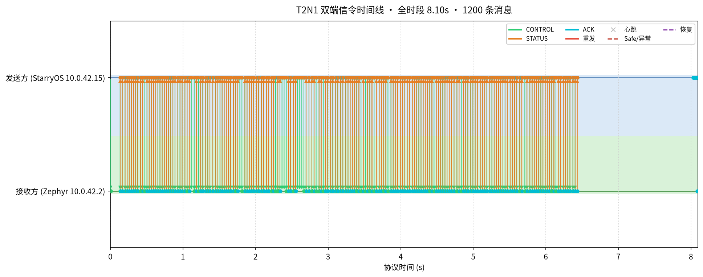
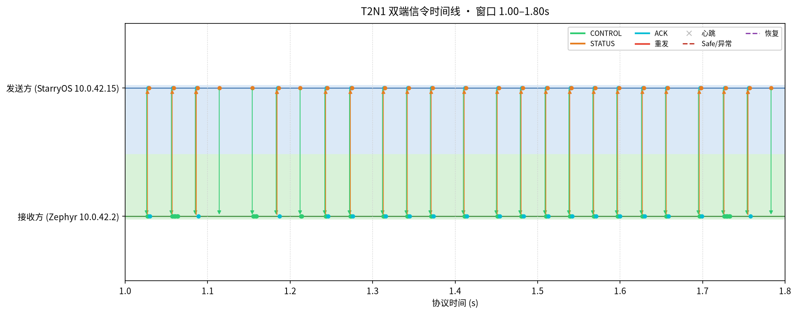
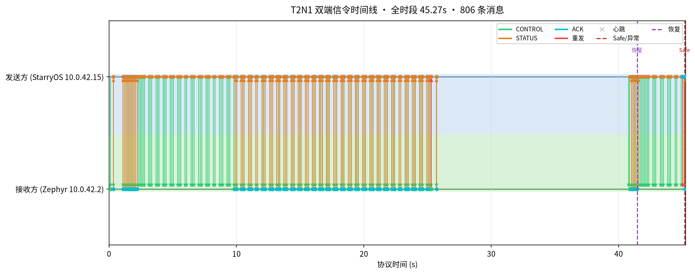
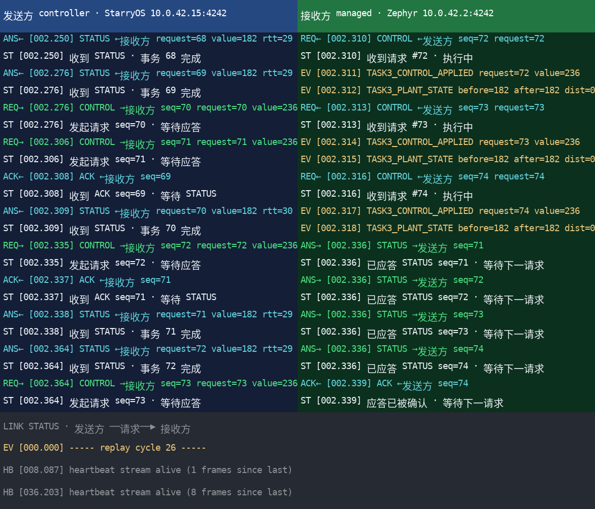

# Task 2：双 Guest 通信设计与结果

## 任务思路：把网络、协议可靠性和安全状态分成三层

赛题明确禁止把共享内存、HyperCall 或裸 MMIO 当作主数据通道，因此我们没有把“两个 Guest 能交换字节”当成完成。Task 2 分成三层：

1. **网络层**：每个 Guest 拥有独立 VirtIO-net、virtqueue、DMA carveout、stage-2 映射和 vIRQ，经 AxVisor 内部 L2 switch 交换以太网帧。
2. **传输层**：使用 UDP/IPv4，保留消息边界、实现简单，适合低频控制；UDP 不可靠性由应用协议显式处理。
3. **应用层**：T2N1 定义版本化定长头、类型化 payload、CRC32、序号、ACK、重传、去重、乱序拒绝、心跳和 Safe/恢复状态机。

这种设计让 QEMU 与实板共用同一协议和 endpoint 程序，同时把网络可达性、报文正确性与控制安全分别验证。

## 设计

Task 2 的两个 endpoint 分别在一个 2-vCPU 类 Linux StarryOS Guest 和一个
Zephyr RTOS Guest 内。StarryOS 的通信职责由 vCPU1 承担；不存在第二个
Linux Guest。

Task 2 在正式物理架构中的位置如下；它只负责虚线框内的双向通信，
NPU 和 AI 数据面不是 Task 2 独立吞吐测试的负载。

```text
pCPU2                                      pCPU1（共享核）
+----------------------------+             +--------------------------+
| StarryOS vCPU0             |             | StarryOS vCPU1           |
| 图像 / RKNN / NPU / 决策   |-- 候选控制 ->| Task 2 controller        |
+----------------------------+             +------------+-------------+
                                                      |
                           . . . . . . . . . . . . . .|. . . . . . .
                           .                          v              .
                           .  VirtIO-net -> L2 switch -> VirtIO-net .
                           .       UDP/IPv4 + T2N1                   .
                           .                          |              .
                           .                          v              .
                           .              +----------------------+  .
                           .              | Zephyr RTOS vCPU0   |  .
                           .              | 执行 + ACK/STATUS   |  .
                           .              +----------------------+  .
                           . . . . . . Task 2 双向可靠链路 . . . .
```

StarryOS 和 Zephyr 拥有独立 VirtIO-MMIO 队列、DMA 区间、stage-2 映射和 vIRQ 路由，两 endpoint 加入 AxVisor 内部 L2 switch。主数据面是 UDP/IPv4；共享内存、HyperCall、裸 MMIO 和 vsock 不是控制通道，QMP 只用于故障控制和 QEMU 生命周期。

| QEMU 字段 | StarryOS | Zephyr |
| --- | --- | --- |
| IPv4 | `10.0.42.15/24` | `10.0.42.2/24` |
| UDP | `4242` | `4242` |
| MAC | `52:54:00:12:34:01` | `52:54:00:12:34:02` |

物理板统一模板把 StarryOS MAC 配置为 `52:54:00:12:34:15`、Zephyr 保持 `52:54:00:12:34:02`；IP 与端口不变。MAC 的最后一字节差异只用于区分环境，不改变 T2N1 线格式或 endpoint 语义。

T2N1 定长头包含 magic、version、kind、flags、session、sequence、acknowledgement、payload length、error code 和 CRC32，支持 CONTROL、STATUS、ACK、ERROR 和 HEARTBEAT。CONTROL/STATUS 使用 stop-and-wait ACK、有界重传、重复抑制和乱序检查。心跳超时、重试耗尽或严重协议错误进入 Safe，恢复后可靠流从 sequence 1 重新同步。

## T2N1 报文格式

一个 UDP datagram 只承载一个 T2N1 frame。所有多字节整数使用网络字节序（big-endian），固定头为 28 字节，payload 最大 1200 字节。

| 字节偏移 | 长度 | 字段 | 当前值/语义 |
| ---: | ---: | --- | --- |
| 0 | 4 | `magic` | ASCII `T2N1` |
| 4 | 1 | `version` | 当前为 1 |
| 5 | 1 | `kind` | 1 CONTROL；2 STATUS；3 ERROR；4 ACK；5 HEARTBEAT |
| 6 | 2 | `flags` | bit 0=`RELIABLE`，其余位必须为 0 |
| 8 | 4 | `session` | 会话身份；当前 endpoint 使用 `0x54525432` |
| 12 | 4 | `sequence` | CONTROL/STATUS 的非零可靠序号；回绕时跳过 0 |
| 16 | 4 | `acknowledgement` | ACK 或 ERROR 所关联的序号；无关联时为 0 |
| 20 | 2 | `payload_len` | 0–1200，必须等于 UDP 数据报剩余长度 |
| 22 | 2 | `error_code` | 0 None；1 InvalidParameter；2 OutOfOrder；3 UnsupportedMessage；4 SessionMismatch |
| 24 | 4 | `crc32` | IEEE CRC-32；计算时本字段按 0 处理，覆盖头和 payload |

同一布局用矩形拼接表示如下；括号内是字节偏移，横向宽度不代表实际显示字符数：

```text
0                   4   5   6       8          12         16         20  22      24         28
+-------------------+---+---+-------+----------+----------+----------+---+-------+----------+
| magic = "T2N1"    |ver|kind| flags | session  | sequence |   ack    |len| error |  crc32   |
|       4 B         |1 B|1 B |  2 B  |   4 B    |   4 B    |   4 B   |2 B|  2 B  |   4 B    |
+-------------------+---+---+-------+----------+----------+----------+---+-------+----------+
|<-------------------------------- fixed header: 28 B ------------------------------->|
|<---------------- payload_len B: 0..1200；一个 UDP datagram 仅一个 frame ----------->|
```

类型化 payload：

| 消息 | payload 布局 | 语义 |
| --- | --- | --- |
| CONTROL（12 B） | `action:u8, reserved[3], value:i32, request_id:u32` | action 1=SetOutput、2=Stop、3=Reset；SetOutput 范围 0–1000 |
| STATUS（12 B） | `state:u8, flags:u8, reserved[2], value:i32, last_request_id:u32` | state 1=Active、2=Stopped、3=Safe；返回当前值和最近已执行请求 |
| ACK（0 B） | 无 payload | `acknowledgement` 指向已接受可靠帧 |
| ERROR（0–1200 B） | 可选诊断字节 | `error_code` 给出机器可判定原因，`acknowledgement` 关联被拒帧 |
| HEARTBEAT（8 B） | `uptime_ms:u64` | 非可靠、无序号，用于双向存活检测 |

```text
CONTROL payload (12 B)                  STATUS payload (12 B)
+--------+-------------+------+---------+ +-------+-------+------+---------+-----------+
| action | reserved[3] | value:i32      | | state | flags |rsv[2]| value:i32          |
|  1 B   |     3 B     |      4 B       | |  1 B  |  1 B | 2 B  |      4 B           |
+--------+-------------+------+---------+ +-------+-------+------+---------+-----------+
| request_id:u32              |           | last_request_id:u32              |
|          4 B                |           |          4 B                     |
+-----------------------------+           +----------------------------------+
```

CONTROL/STATUS 是 stop-and-wait：首次发送后 500 ms 未确认则重传，最多重传 5 次；心跳间隔 200 ms，5 s 内没有合法入站帧则进入 Safe。重复帧只重新 ACK、不重复执行；超前序号返回 OutOfOrder；重试耗尽或严重协议错误进入 Safe；合法链路恢复后序号从 1 重启。协议实现是 [`components/task2-net-protocol/`](../components/task2-net-protocol/)，不是只存在于文档中的格式。

一个完整可靠控制事务不是一个 UDP 包，而是四步闭环：

```text
StarryOS controller                       Zephyr executor
       |                                       |
       | CONTROL(seq=N, request=R)             |
       |-------------------------------------->|
       |                         校验、去重、执行动作
       | ACK(ack=N)                            |
       |<--------------------------------------|
       | STATUS(seq=M, last_request=R)         |
       |<--------------------------------------|
       | ACK(ack=M)                            |
       |-------------------------------------->|
       |                                       |
       +-- transaction complete；RTT 在同一 StarryOS CLOCK_MONOTONIC 上闭合
```

```text
                 合法帧/ACK恢复
        +----------------------------------+
        |                                  v
   +----------+  peer timeout/retry  +-----------+
   |  Active  |--------------------->|   Safe    |
   +----------+                      +-----------+
        | duplicate                         |
        +-- 仅重发 ACK，不重复执行           +-- sequence 从 1 重新同步
        |
        +-- out-of-order/invalid --> ERROR + 明确拒绝
```

## Task2/Task3 隔离

新的 `suite task2` 六场景统一设置 `STARRY_TASK23_SCOPE=task2`：

- 不要求、安装或校验 YOLO 模型文件；
- 不等待 `TASK3_MODEL_READY`；
- 不执行推理或检测；
- 验证器要求日志中不得出现 `TASK3_(MODEL|INFER|DETECTION|EXPERIMENT)` 活动，并给出 `TASK2_MODEL_ISOLATION_PASS`。

因此这套证据能单独回答“Task 2 自身是否通过”，不再借助 Task 3 模型活动作为 CONTROL 源。

## 六场景 QEMU 独立验证

证据根：`tmp/competition-task123/current-fix-qemu/20260824T201803Z-suite-task2-2820310/`

| 场景 | 主验行为 | 双端一致 T2N1 帧数 | 结果 |
| --- | --- | ---: | --- |
| `task2-normal` | CONTROL -> ACK/STATUS | 31 | **PASS** |
| `task2-drop-ack` | 单次丢 ACK、重传和重复抑制 | 33 | **PASS** |
| `task2-retry-exhausted` | 有界重试、Safe 和恢复 | 24 | **PASS** |
| `task2-blackout` | 双向中断、双端 Safe 和恢复 | 34 | **PASS** |
| `task2-out-of-order` | 乱序 CONTROL 显式拒绝并恢复 | 25 | **PASS** |
| `task2-invalid-parameter` | CRC 合法但越界的控制值被拒绝 | 26 | **PASS** |

每个子目录保存 `run.log`、StarryOS/Zephyr 双 pcap、`verify-scenario.log`、`verify-pcap.log`、源/运行时 TOML、产物与 rootfs 哈希、源码身份和 `SHA256SUMS.txt`。六个场景均通过语义验证、双 pcap 账本验证和模型隔离验证。

### 正常态与故障态对比

| 场景 | 正常/故障差异 | 可观察结果 |
| --- | --- | --- |
| normal | 无注入 | controller 可见 CONTROL→STATUS 3/3；RTT 45–338 ms，均值 152.0 ms |
| drop-ack | 首个 ACK 丢失 | 可靠帧重传，RTOS 对重复序号不重复执行；场景 33 帧，PASS |
| retry-exhausted | 连续丢 ACK | 5 次有界重传后进入 Safe，随后恢复；场景 24 帧，PASS |
| blackout | 双向链路中断 | `RetryExhausted` 后 Safe，链路恢复后 sequence 从 1 重启，恢复请求 RTT 59 ms；场景 34 帧，PASS |
| out-of-order | 注入超前序号 | 330 ms 观察 Safe、500 ms 恢复，恢复请求 RTT 64 ms；场景 25 帧，PASS |
| invalid-parameter | CRC 合法但 value 越界 | 返回 InvalidParameter，331 ms 观察 Safe、504 ms 恢复，恢复请求 RTT 64 ms；场景 26 帧，PASS |

这里的 RTT 是 StarryOS 同一单调时钟上从 CONTROL 发送到匹配 STATUS 收到的
应用闭环时间，包含两个 Guest 调度、网络、RTOS 执行和回包；不是裸 UDP
单向延迟。六个 QEMU 场景用于验证低频控制正确性与故障恢复；独立吞吐量由
后面的实板 3×200 基准给出，不能用故障场景帧数冒充网络吞吐量。

## Task 2 独立实板有界吞吐：PASS（3×200）

为避免用 Task 3 场景帧数冒充 Task 2 指标，新增了无模型、固定 200 request 的
有界基准。一个 transaction 必须完成上面的 CONTROL→ACK→STATUS→ACK 四步；最终
CONTROL ACK 和最终 STATUS ACK 都闭合后才打印 END。

| 指标 | 三轮汇总 |
| --- | ---: |
| 完整事务 | 600/600（100%） |
| Controller 收到 ACK | 600/600 |
| 应用错误 / timeout | 0 / 0 |
| 重传 | 0（0%） |
| 平均有效吞吐 | 31.834 transactions/s |
| 单轮吞吐范围 | 31.675–32.046 transactions/s |
| 跨轮平均 CONTROL→STATUS RTT | 31.408 ms |
| 单轮中位 P50 / P95 / P99 | 30 / 40 / 41 ms |
| 观测最大 RTT | 131 ms |

快速读数：

```text
3 轮 × 200 事务

request       [##################################################] 600
transaction   [##################################################] 600  (100%)
ACK received  [##################################################] 600
retry         [                                                  ]   0
error/timeout [                                                  ]   0

平均有效吞吐       31.834 complete transactions/s
平均应用闭环 RTT   31.408 ms
单轮 P50 / P95 / P99  30 / 40 / 41 ms
```

这里的一个 `transaction` 必须完整包含
`CONTROL -> ACK -> STATUS -> ACK`；因此 `31.834 transactions/s` 表示完整
工业控制闭环的完成率，不是 UDP packet/s，也不是网卡线速。

逐轮 elapsed 分别为 6314/6241/6293 ms；逐轮 200/200 transaction。机器可读
JSON、三份原始串口日志、payload 和 SHA-256 位于
[`bounded-200`](../results/task2/board-20260825/bounded-200/)，正式摘要为
[`TASK2-BOUNDED-THROUGHPUT.md`](../results/task2/board-20260825/bounded-200/TASK2-BOUNDED-THROUGHPUT.md)。

### 可视化复现

```bash
scripts/competition/task123.sh board demo
```

Task 2 输出位于 [`bounded-200/demo`](../results/task2/board-20260825/bounded-200/demo/)：
`dashboard.html` 逐事务重放 CONTROL→ACK→STATUS→ACK，左侧显示 request/value，
中央显示 RTT、累计吞吐和重传，右侧显示 Zephyr state/value；`dashboard.png` 是
1480×720 静态截图。`raw/` 保存被解析的 console，`dashboard-data.json` 保存逐事务
数据。`task123.sh board demo-video` 另生成 6 s、1480×720、30 fps H.264
`dashboard.mp4`，它的 SHA-256 为
`4278c9c6f5b1235144e97c3176523e54458afca79dca65e177f3e3288cee605b`。视频和
原始日志一起纳入 `artifact-index.json`，不用画面替代协议验证。
输入日志仍先通过 `quantify-benchmark.py` 的完整序号、计数闭合和 fatal-marker 检查。

### 双端信令时间线图与演示画面

实板串口把两个 Guest 的控制台输出批量混合在一起（VirtIO-console 分批 drain），
直接看原始日志难以还原"谁先谁后"。用 `scripts/board/task2-signaling-replay.py`
按 request id 把两端重排成规范的"请求→收到→执行→应答→确认"顺序并加上协议时间戳，
再用 `scripts/board/task2-signaling-chart.py` 绘成"时间 × 泳道"时间线：
发送方在上、接收方在下，每条 CONTROL/STATUS/ACK 是穿过两泳道的彩色箭头，
RTT 与先后关系一眼可见。`scripts/board/task2-signaling-shot.py` 从 feed 渲染
演示画面（左蓝发送方 / 右绿接收方 / 下方链路状态条，含 REQ→/ANS←/ACK← 等角色标识）。

以下四张图来自 2026-08-28 的实板录制（`results/task2/board-20260828/bounded-200/`，
单轮 200 笔干净事务，0 重传）与同一仓库的黑障故障录制：

| 图 | 内容 |
| --- | --- |
|  | 200 笔干净收发全时段（8.1 s，1200 条消息，0 重传），两端严格 200:200 |
|  | 1.0–1.8 s 放大窗口，看清一问一答与约 40 ms RTT |
|  | 黑障故障场景：红色重传丛、Safe 虚线、恢复后序号从 1 重启 |
|  | tmux 演示画面渲染：发送方（蓝）/接收方（绿）双 pane + 链路状态条 |

每张图怎么看：

1. **演示画面**（`1-demo-screen.png`）：复刻 tmux 的 I_I 布局——左上是发送方
   （controller，深蓝底，标题"发送方 · StarryOS 10.0.42.15"），右上是接收方
   （managed，深绿底，"接收方 · Zephyr 10.0.42.2"），下方是横跨全宽的链路状态条。
   每行以角色相对标签开头：发送方发出的请求是 `REQ→`、收到的应答是 `ANS←`/`ACK←`；
   接收方收到的请求是 `REQ←`、回发的应答是 `ANS→`/`ACK←`；`ST` 行是这端当前的
   协议状态（如"发起请求 seq=N · 等待应答"）。底色区分两端，交换角色名立刻穿帮。

2. **干净 200 笔全时段**（`2-timeline-clean-full.png`）：横轴是协议时间
   （task2-net 启动后秒数），上泳道=发送方、下泳道=接收方。每条 CONTROL/STATUS/ACK
   是一条穿泳道的竖箭头，颜色按类型：绿 CONTROL、橙 STATUS、青 ACK。整段 8.1 s 内
   两端严格 200:200、无重传、无 Safe，说明链路干净。图右上角图例给出颜色对应。

3. **放大窗口**（`3-timeline-clean-zoom.png`）：把 1.0–1.8 s 拉宽，能逐笔读出
   一问一答——绿色 CONTROL 箭头落到接收方，随后橙色 STATUS 与青色 ACK 回到发送方，
   再回一条青色 ACK。同一笔的 CONTROL 与 STATUS 之间横跨约 40 ms，即 RTT。

4. **黑障对照**（`4-timeline-blackout.png`）：45 s 全时段，含黑障注入。黑障窗口内
   发送方反复重发（红色 `重发` 箭头成丛）、无应答后进 Safe（红色虚线），接收方也
   因 5 s 无合法帧进 Safe；链路恢复后（紫色虚线"恢复"）序号从 1 重新同步，收发恢复。

```bash
# 时间线（全时段 / 放大窗口）
scripts/board/task2-signaling-chart.py <run.log> --out timeline-full.png
scripts/board/task2-signaling-chart.py <run.log> --out timeline-zoom.png --zoom 1.0 1.8
# 演示画面（从 replay 生成的 feed 渲染）
scripts/board/task2-signaling-shot.py --feeds /tmp/t2n1-demo/feeds --out shot.png
```

时间线图与演示画面的配色一致：绿色 CONTROL、橙色 STATUS、青色 ACK、红色重传、
红/紫虚线为 Safe/恢复。时间线只用于演示协议顺序，协议验证仍以原始日志、双 pcap
和 verifier 为准。

这个 throughput 是 stop-and-wait 控制事务/s，不是裸 UDP 带宽。受 10 ms 轮询/
状态节拍、两 Guest 调度、VirtIO 中断和 ACK 往返共同限制；它适合回答工业控制
闭环容量，不能换算成网卡线速。

QEMU 六场景与实板 3×200 已按统一 schema 写入
[`all-platform-summary.csv`](../results/task2/all-platform-summary.csv)，字段包括 platform、
scenario、request/success/error/timeout/retry/recovery、RTT 分位数和 throughput。
故障场景没有测量的吞吐/分位数保持空值，详细口径见
[`ALL-PLATFORM-METRICS.md`](../results/task2/ALL-PLATFORM-METRICS.md)。

`task2-invalid-parameter` 还有一次独立重跑：`tmp/competition-task123/current-fix-qemu/20260824T201725Z-task2-invalid-parameter-2819432/`，其双端均观测到 28 个 T2N1 帧并通过两类验证器。

## 旧失败的真实原因

之前某次场景的 watchdog 超时不是协议或 Guest 的确定性失败。当时两个各自使用 `-m 8g` 的 QEMU 在约 15 GiB 物理内存的主机上并发，swap 已用满 `4/4 GiB`，严重内存压力使串口进度停滞，watchdog 因而产生假超时。

当前统一入口使用 `TASK123_QEMU_LOCK_FILE` 和
`TASK123_QEMU_LOCK_TIMEOUT_SEC` 互斥 QEMU 执行槽。真实重跑中，Task 1
和 Task 2 被正确串行化，六个通信场景随后整套通过。因此保持资源互斥，
不通过放大 watchdog 隐藏资源问题。

## 实板边界

当前分支已完成 Task 2 独立实板正常态 3×200 有界吞吐验证；故障语义由
Task2-only QEMU 的五类注入场景覆盖。没有把 QEMU 故障恢复写成实板故障矩阵，
也没有把 Task 3 的场景帧数冒充 Task 2 吞吐量。

## 实现范围与证据映射

| 能力 | 已完成内容 | 证据 |
| --- | --- | --- |
| StarryOS 与 RTOS IP 链路 | 双 VirtIO-net、L2 switch、MAC/IP/UDP 4242 | 双端启动日志、网络配置和 pcap |
| 应用协议 | T2N1 28 B 头、类型化 payload、网络字节序、CRC32 | 协议 crate、ASCII 字段图和帧解析器 |
| 消息语义 | CONTROL、STATUS、ERROR、ACK、HEARTBEAT | 两端 endpoint 与逐事务账本 |
| 可靠性与恢复 | ACK、500 ms 超时、5 次重传、去重、乱序、5 s liveness、Safe/恢复 | 正常态和五种故障注入场景 |
| 独立性能 | 三轮各 200 个完整事务 | CSV/JSON、原始日志和展示面板 |
| 隔离与访问控制 | 独立 virtqueue/DMA/stage-2/vIRQ，NPU 不暴露给 RTOS | VM 配置与隔离验证器 |

赛题任务要求的请求成功率、应用错误、超时、恢复、延迟和有效吞吐量现已分别由
QEMU 六场景与实板 3×200 基准覆盖，并已合并为统一 CSV schema；可配置一键入口与
dashboard 也已提供。
